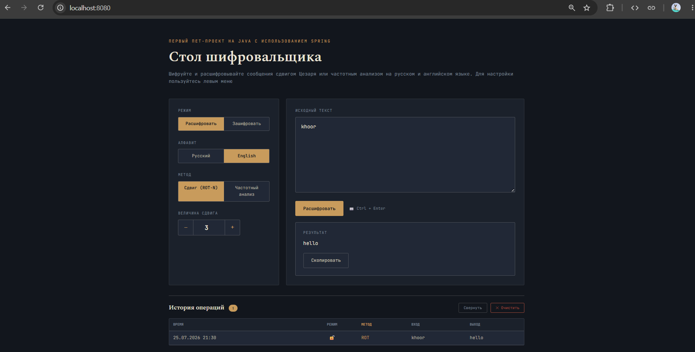

# 🔐 Стол шифровальщика

Веб-приложение для шифрования и расшифровки текста двумя классическими методами - шифром Цезаря (ROT-N) и частотным
анализом с поддержкой русского и английского алфавитов. Всё происходит на сервере, интерфейс обновляется без 
перезагрузки страницы.



---

## О проекте

Изначально это было учебное задание из моего университета - консольный декриптор, 
реализующий шифр Цезаря и частотный анализ текста. Со временем идея вышла за рамки
учебной консоли - логика была переработана, код покрыт тестами, разработан 
веб-сервис на Spring Boot и web интерфейс. 
> Это мой первый проект на Spring,
> да и вообще первый, поэтому он не идеален и не претендует на масштабность или серьёзность, его задумка и реализация 
> просты, например вместо базы данных используются HTTP сессии. Однако он является моим первым 
> шагом в мир программирования.

## Возможности

- **Два метода дешифрования/шифрования**
    - **ROT-N (шифр Цезаря)** - сдвиг каждой буквы алфавита на заданное число позиций, с настраиваемой величиной сдвига.
    - **Частотный анализ** - сопоставление букв текста с буквами алфавита по рангу частоты встречаемости (самая частая
  буква текста → самая частая буква языка, и так далее).
- **Два алфавита** - русский (33 буквы) и английский (26 букв).
- **Шифрование и расшифровка** в одном интерфейсе - переключение режима одной кнопкой.
- **Сохранение истории операций**.
- **Валидация ввода** - если текст содержит символы, не относящиеся к выбранному алфавиту, пользователь получает 
понятное сообщение об ошибке.
- **Продуманное логирование** позволяет следить за работой приложения. Уровень можно выбрать в файле application.properties.

## Стек

**Backend**
- Java 21
- Spring Boot 4.1 (Spring Web, Spring Boot Starter Validation)
- Thymeleaf - серверный рендеринг HTML
- Maven

**Тестирование**
- JUnit 5
- Spring Boot Test, MockMvc

**Frontend**
- HTML5 + Thymeleaf-шаблоны
- Чистый CSS 
- Чистый JavaScript

> Стоит честно отметить, что я не очень силён в дизайне фронтенда, поэтому за помощью в сложных 
> ситуациях этой части проекта я обращался к ИИ.

## Технические подробности
### Архитектура

```
decrypt/
├── controller/     — обработка HTTP-запросов (DecryptController)
├── service/        — бизнес-логика (CipherService, HistoryService)
├── decryptor/      — стратегии шифрования (ROT-N, частотный анализ) + фабрика
├── substitutor/    — применение таблицы замен к тексту
└── vocabulary/     — алфавиты (русский, английский) + фабрика
```

Каждый метод шифрования реализует общий интерфейс `Decryptor`. 
Алфавиты устроены аналогично. Такая структура позволяет добавлять новые
методы шифрования, не трогая остальной код 

### Другие детали

- История хранится в HTTP-сессии, без базы данных, с лимитом в 50 записей - при превышении
  старая запись удаляется автоматически.
- Обновление без перезагрузки сделано через `fetch` и `DOMParser`, а не через отдельный
  JSON-эндпоинт: сервер рендерит HTML, фронтенд вытаскивает из ответа нужные куски
  и подставляет их в текущую страницу.
- Ошибки обрабатываются через `@ExceptionHandler` в контроллере, вместо страницы 500
  пользователь видит понятное сообщение.
- Валидация текста - если введены символы не из выбранного алфавита (например, русского
  при английском), приложение сразу сообщает об ошибке, а не падает.
- Тестирование - модульные тесты для алфавитов, дешифраторов, подстановщика и частотного
  анализа, плюс интеграционные тесты контроллера (`MockMvc`) на HTTP-эндпоинты, обработку
  ошибок и историю сессии.
- Maven Wrapper - файлы `mvnw` и `mvnw.cmd` добавлены в проект - при запуске через терминал
  Maven устанавливать отдельно не нужно, скрипт сам скачает нужную версию.

## Структура проекта

```
Cipher-Desk/
├── docs/                               — скриншот для README
├── src/
│   ├── main/
│   │   ├── java/decrypt/               — исходный код приложения
│   │   └── resources/
│   │       ├── static/                 — CSS, JS, favicon
│   │       ├── templates/              — HTML
│   │       └── application.properties  — настройки, в частности, логирования
│   └── test/
│       └── java/decrypt/               — юнит- и интеграционные тесты
├── mvnw, mvnw.cmd                      — Maven Wrapper
└── pom.xml
```

## Запуск проекта


Клонирование и запуск:

```bash
git clone https://github.com/kalamburya/Cipher-Desk.git
cd Cipher-Desk

# Linux / macOS
./mvnw spring-boot:run

# Windows
mvnw.cmd spring-boot:run
```

После запуска приложение будет доступно по адресу:

```
http://localhost:8080
```

### Запуск тестов

```bash
./mvnw clean test
```

## Как пользоваться

1. Вставьте или наберите текст в поле ввода.
2. Выберите режим — **«Расшифровать»** или **«Зашифровать»**.
3. Выберите алфавит — русский или английский.
4. Выберите метод — сдвиг (ROT-N) или частотный анализ.
5. Если выбран ROT-N — укажите величину сдвига стрелками или вручную.
6. Нажмите **«Расшифровать»/«Зашифровать»** (или `Ctrl + Enter`) - результат появится ниже, а операция сохранится
в историю.

## Лицензия

Выбрана лицензия MIT.

## Автор

**Vadim Pavlov** - [GitHub: kalamburya](https://github.com/kalamburya)
